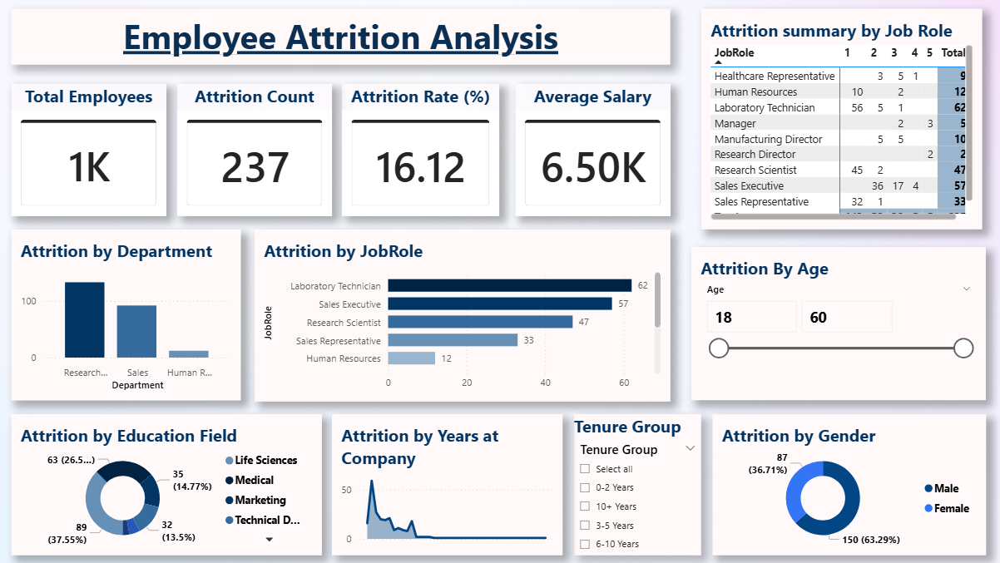
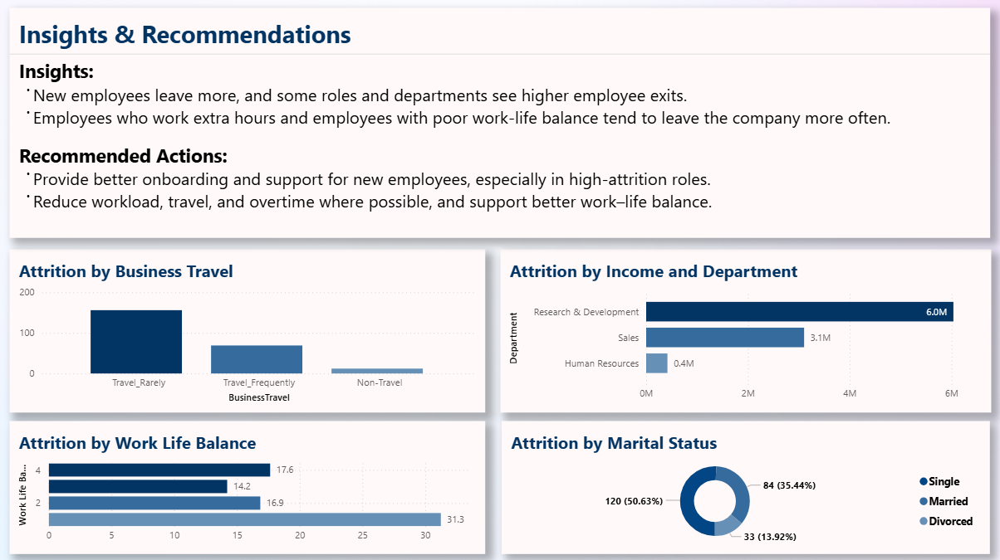

# Employee Attrition Analysis – Power BI

## Overview
This project uses Power BI to analyse employee data and
understand why employee leaves a company.

## Key Insights
- Overall attrition rate
- Department and job role analysis
- Impact of age, salary, and experience
- Interactive slicers for deep analysis

## Tools Used
- Power BI
- DAX
- Data Cleaning & Modeling

## How to Use
Download the PBIX file and open it using Power BI Desktop.

## Dashboard Preview

## Dataset
The dataset used for this analysis is included in this repository
for reference and learning purposes.

